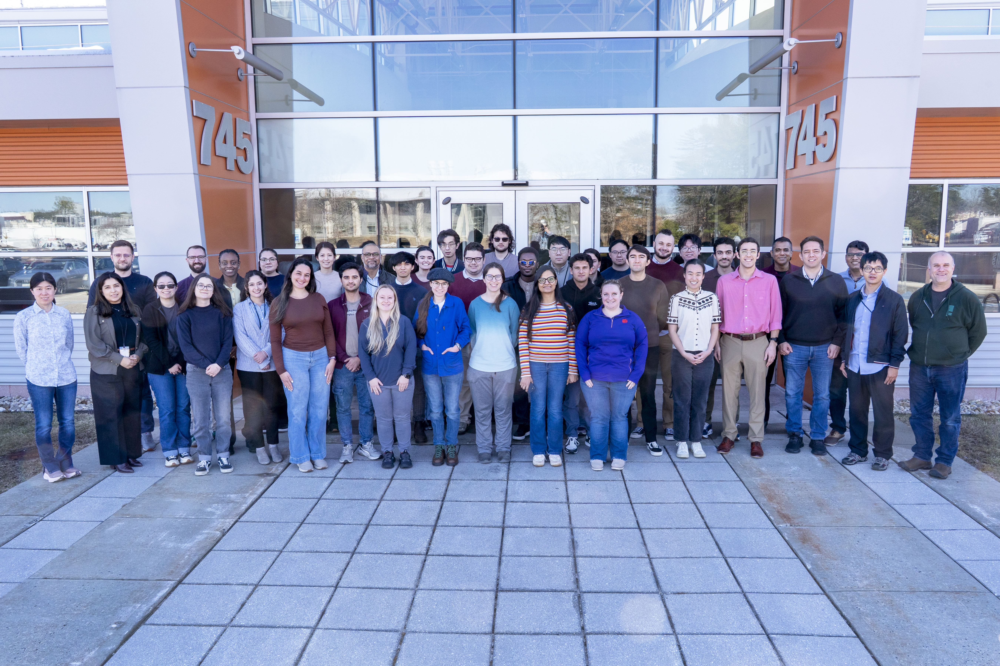

March 10-12, 2026
=================

|nbsp|

.. admonition:: TL;DR

   Download all slide decks and other course materials:
   :download:`March2026.zip <_static/March2026.zip>`

X-ray absorption spectroscopy is a core technique of the DOE
synchrotron user facilities and attracts diverse scientific
communities. This 3-day course offered by NSLS-II experts introduced
XAS data analysis to new and prospective users and provided an
opportunity to participate in measurements at NSLS-II XAS
beamlines. The first two days were devoted to the fundamentals of XAS
analysis, data reduction and processing, and the basics of XAS
experiments and instrumentation.

Participants were trained on XAS data analysis of increasing
complexity.  Modern XAS methods such as high-resolution spectroscopy
were be introduced. On the third day, the participants participated in
experiments at the ISS, QAS, and BMM and toured TES.

`Course page at NSLS-II <https://www.bnl.gov/xascourse/>`__

This course was organized and presented by 
`Lu Ma <https://www.bnl.gov/staff/luma>`__, 
`Bruce Ravel <https://www.bnl.gov/staff/bravel>`__,
`Akhil Tayal <https://www.bnl.gov/staff/atayal>`__,
`Jorge Moncada Vivas <https://www.bnl.gov/staff/jmoncadav>`__, 
`Dali Yang <https://www.bnl.gov/staff/dyang5>`__,
`Dominick Wierzbicki <https://www.bnl.gov/staff/dwierzbic2>`__, and
`Steve Farrell <https://www.bnl.gov/staff/sfarrell1>`__.

`Olga More <https://www.bnl.gov/staff/omore>`__ and 
`Mercy Baez <https://www.bnl.gov/staff/baez>`__
provided logistical support.

.. _fig-groupphoto2026:

   The participants and instructors of the March 2026 XAS Workshop

Tuesday, March 10
-----------------

:Welcome:

   A greeting from the NSLS-II director Elke Arenholz with an overview
   of the scientific mission of the light source

   + Presenter: `Elke Arenholz <https://www.bnl.gov/staff/earenholz>`__
   + Slide deck: :download:`2026 XAS Workshop Introduction.pdf
     <_static/March2026/2026 XAS Workshop Introduction.pdf>`
   + Safety moment: :download:`2025 XAS Workshop Safety.pdf
     <_static/March2025/2025 XAS Workshop Safety.pdf>`

   | 

:Introduction to XAS:

   Overview of the basic physics and chemistry of XAS

   + Presenter: `Lu Ma <https://www.bnl.gov/staff/luma>`__
   + Slide deck: :download:`2026_XAS_intro_Lu Ma_final.pdf <_static/March2026/2026_XAS_intro_Lu Ma_final.pdf>`

   | 

:Data reduction and background removal:

   An introduction to processing XAS data, including background
   subtraction and Fourier transforms

   + Presenter: `Akhil Tayal <https://www.bnl.gov/staff/atayal>`__
   + Slide deck: :download:`XAFS_Normalization_2026.pdf <_static/March2026/XAFS_Normalization_2026.pdf>`

   | 

:XANES Fundamental and Analysis:

   An introduction to the information content of the XANES portion of
   the XAS spectrum.

   + Presenter: `Jorge Moncada Vivas <https://www.bnl.gov/staff/jmoncadav>`__ 
   + Slide Deck: :download:`XAFS_Normalization_2026.pdf <_static/March2026/XAFS_Normalization_2026.pdf>`

   | 

:EXAFS analysis I:

   An introductory EXAFS data analysis problem using FeS\
   :sub:`2`. This is the introduction to fitting EXAFS data analysis
   with Feff and Artemis

   + Presenter: `Bruce Ravel <https://www.bnl.gov/staff/bravel>`__
   + |mu|\ (E) data: :download:`FeS2_RT.xmu <_static/March2025/FeS2/FeS2_RT.xmu>`
   + crystal data: :download:`FeS2.inp <_static/March2025/FeS2/FeS2.inp>`
     (this is a file format that Artemis can inport)
   + final fitting model: :download:`FeS2_final.fpj <_static/March2025/FeS2/FeS2_final.fpj>`
   + discussion of FeS\ :sub:`2` final fit: :download:`fes2.pdf <_static/March2025/fes2.pdf>`

   | 

:Sample Preparation and Environments:

   A discussion of how to best prepare for and optimize your XAS
   experiment.

   + Presenter: `Steve Farrell <https://www.bnl.gov/staff/sfarrell1>`__
   + Slide Deck: :download:`2026 XAS Workshop - Sample Preparation -
     Farrell.pdf <_static/March2026/2026 XAS Workshop - Sample
     Preparation - Farrell.pdf>`

   |

Wednesday, March 11
-------------------

:Combined Techniques:

   How XAFS measurements can be combined with other measurement techniques.

   + Presenter: `Lu Ma <https://www.bnl.gov/staff/luma>`__
   + Slide Deck: :download:`combined techniques 2026-1.pdf <_static/March2026/combined techniques 2026-1.pdf>`

   |

:High Energy Resolution Techniques:

   Using crystal spectrometers to improve the energy resolution of the
   XANES measurements

   + Presenter: `Dominick Wierzbicki <https://www.bnl.gov/staff/dwierzbic2>`__
   + Slide Deck: :download:`High-energy-resolution.pdf <_static/March2026/High-energy-resolution.pdf>`

   |

:EXAFS analysis I:

   The FeS\ :sub:`2` example from the previous day might seem a bit
   too simple.  It involves analysis of a crystalline material, thus
   the path through the analysis obviously starts with crystal data.
   In these two lectures, some ideas are presented about how to
   perform EXAFS analysis on more complex materials.

   + Presenter: `Bruce Ravel <https://www.bnl.gov/staff/bravel>`__
   + EXAFS and non-crystalline materials: :download:`noxtal.pdf <_static/March2025/noxtal.pdf>`
   + A hard EXAFS problem, Hg bound to nucleotides: :download:`hgdna.pdf <_static/March2025/hgdna.pdf>` [`Ref #1 <https://doi.org/10.1016/j.radphyschem.2009.05.024>`__] [`Ref #2 <https://doi.org/10.1088/1742-6596/190/1/012026>`__]

   |

:Understanding the EXAFS Equation:

   A deep dive into the meaning of the terms in the EXAFS equation

   + Presenter: `Dali Yang <https://www.bnl.gov/staff/dyang5>`__
   + Slide Deck: :download:`XAS_School_EXAFS_Equation_Dali.pdf <_static/March2026/XAS_School_EXAFS_Equation_Dali.pdf>`

   |

:Writing proposals:

   Hints and tips for successfully navigating the NSLS-II proposal
   system (and the proposal systems at other synchrotrons).

   + Presenter: `Lisa Miller <https://www.bnl.gov/staff/lmiller>`__
   + Slide deck: :download:`2026-03-11 XAS course-proposal writing.pdf <_static/March2026/2026-03-11 XAS course-proposal writing.pdf>` 
   + Beamlines slides: :download:`XAS_Beamlines.pdf <_static/March2026/XAS_Beamlines.pdf>` 

   |

Thursday, March 12
------------------

:Experimental session: 

   Hands-on XAS data collection at the NSLS-II hard X-ray spectroscopy beamlines

   + `QAS <https://www.bnl.gov/nsls2/beamlines/beamline.php?r=7-BM>`__
   + `BMM <https://www.bnl.gov/nsls2/beamlines/beamline.php?r=6-BM>`__
   + `ISS <https://www.bnl.gov/nsls2/beamlines/beamline.php?r=8-ID>`__
   + with tours of `TES <https://www.bnl.gov/nsls2/beamlines/beamline.php?r=8-BM>`__

Data from QAS
~~~~~~~~~~~~~

Zip file containing data from QAS:
:download:`QAS data 2026.zip <_static/March2026/QAS data 2026.zip>`

Data from BMM
~~~~~~~~~~~~~

During the hands-on experiment at BMM in the afternoon, we measured
several Mn standards along with the mineral `babingtonite
<https://en.wikipedia.org/wiki/Babingtonite>`__ in fluorescence at the
Mn and Fe edges.

Zip file containing these data and the full electronic log book:
:download:`BMM-data.zip <_static/March2026/BMM-data.zip>`

Data from ISS
~~~~~~~~~~~~~

Zip file containing data from ISS:
:download:`ISS-data.zip <_static/March2026/ISS-data.zip>`

Links and Resources
-------------------

Here is a zip file with all of the downloads linked above:
:download:`March2026.zip <_static/March2026.zip>`

Some useful websites:

+ `Larch: Data Analysis Tools for X-ray Spectroscopy <https://xraypy.github.io/xraylarch/>`__
+ `Demeter <https://bruceravel.github.io/demeter/>`__
+ `Tutorials at XrayAbsorption.org <https://xrayabsorption.org/tutorials/>`__
+ `Bruce's XAS Education page <http://bruceravel.github.io/XAS-Education/>`__
+ `A bunch of Bruce's presentations about XAFS <https://speakerdeck.com/bruceravel>`__

Two textbooks about XAFS. (These are non-sponsored Amazon links
offered for convenience and do not constitute an endorsement of this
vendor.)

+ `Scott Calvin's EXAFS For Everyone <https://www.amazon.com/XAFS-Everyone-Scott-Calvin/dp/1032745487?crid=2IPB6I5SY6N6B>`__
+ `Grant Bunker's Introduction to XAFS: A Practical Guide to X-ray Absorption Fine Structure Spectroscopy <https://www.amazon.com/Introduction-XAFS-Practical-Absorption-Spectroscopy/dp/052176775X>`__
